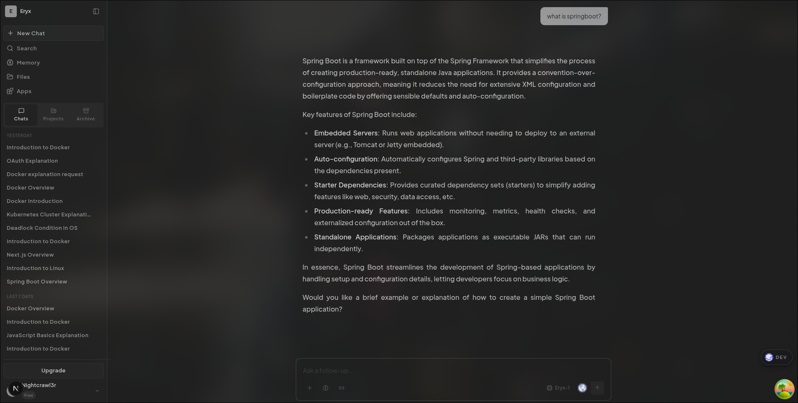

U+# Eryx - Enterprise AI Collaboration Platform

AI-powered chat application with distributed streaming, MCP tool integration, and multi-container deployment support. Built for scale with production-grade resilience patterns.



---

## Tech Stack

| Category | Technology |
|----------|------------|
| Framework | Next.js 16.2.4 (App Router) |
| Language | TypeScript 6 |
| Database | PostgreSQL + Prisma 7 |
| Cache/Queue | Redis + BullMQ |
| AI | Vercel AI SDK + Anthropic/OpenAI/xAI |
| Auth | Stack Auth |
| Payments | Polar, eSewa, Khalti |

---

## Architecture Highlights

The following patterns represent senior-level engineering decisions that handle distributed systems challenges at scale.

### 1. Distributed Resumable Stream Pattern
**Files:** `services/resumable-stream.service.ts`, `services/resumable-pubsub.service.ts`, `services/resume-queue.service.ts`

Enterprise-grade streaming architecture that survives container restarts and cross-container coordination:

- **Redis Pub/Sub** for real-time stream coordination across distributed containers
- **Chunk compression** using Web Streams API gzip for efficient Redis storage
- **Cross-container active detection** via `active:streams` Redis set
- **Auto-queuing failed resumes** with intelligent retry logic
- **Partial refund tracking** via `chatPartial` Redis key

```typescript
// Cross-container active detection
const isActiveRemotely = await getCrossContainerActiveStreams().then(
  (streams) => streams.includes(streamId)
);

// Chunk compression for Redis efficiency
async compressChunk(data: string): Promise<string> {
  const compressedStream = inputStream.pipeThrough(new CompressionStream("gzip"));
}
```

---

### 2. Distributed Circuit Breaker Pattern
**File:** `services/circuit-breaker.service.ts`

Redis-backed circuit breaker with three-state machine (CLOSED/OPEN/HALF_OPEN) protecting external service calls:

```typescript
enum CircuitState { CLOSED = "CLOSED", OPEN = "OPEN", HALF_OPEN = "HALF_OPEN" }

const SERVICE_CONFIGS = {
  openai: { failureThreshold: 3, successThreshold: 2, openTimeoutMs: 15000 },
  polar: { failureThreshold: 5, successThreshold: 2, openTimeoutMs: 30000 },
};
```

Per-service configurations with tuned thresholds:
- **OpenAI**: Aggressive (3 failures triggers open)
- **Payment (Polar)**: Conservative (5 failures, longer timeout)
- **Analytics**: Balanced configuration

---

### 3. Redis Resilience Layer with Fallback Circuit Breakers
**File:** `lib/redis-resilience.ts`

In-memory circuit breakers protecting Redis operations with graceful degradation:

```typescript
export async function withCircuitBreaker<T>(
  operation: string,
  fn: () => Promise<T>,
  fallback: T
): Promise<T> {
  if (isCircuitOpen(operation)) return fallback;
  try {
    const result = await fn();
    recordSuccess(operation);
    return result;
  } catch (error) {
    recordFailure(operation);
    return fallback;
  }
}
```

Pre-configured fallback values ensure the app remains functional during Redis outages.

---

### 4. Multi-Queue BullMQ Processing Pipeline
**File:** `services/queue.service.ts`, `services/workers.ts`

Singleton queue architecture with per-queue concurrency tuning:

```typescript
export const QUEUE_NAMES = {
  WEBHOOK: "webhook",
  SUMMARIZATION: "summarization",
  FILE_PROCESSING: "file-processing",
  EMAIL: "email",
  RESUME: "resume",
  EXPORT: "export",
};

function getConcurrency(queueName: string): number {
  case QUEUE_NAMES.WEBHOOK: return 5;      // Quick response needed
  case QUEUE_NAMES.SUMMARIZATION: return 2; // Expensive AI calls
  case QUEUE_NAMES.EXPORT: return 1;       // Memory intensive
}
```

Idempotent job processing with deduplication and automatic retry.

---

### 5. Role-Based Chat Access Control
**File:** `lib/chat-access.ts`

Single-query ownership + membership authorization pattern:

```typescript
const chat = await prisma.chat.findFirst({
  where: {
    id: chatId,
    OR: [
      { userId },                          // Direct owner
      { members: { some: { userId } } },   // Member
    ],
  },
  select: {
    userId: true,
    members: { where: { userId }, select: { role: true }, take: 1 },
  },
});
```

Uses `SCAN` instead of `KEYS` for non-blocking cache invalidation in production.

---

### 6. MCP Tool Executor with Real-Time Elicitation
**File:** `services/mcp-tool-executor.service.ts`

Model Context Protocol implementation with user confirmation workflows:

```typescript
client.onElicitationRequest(ElicitationRequestSchema, async (request) => {
  const elicitationId = randomUUID();
  // Write elicitation event to SSE stream for real-time UI updates
  dataStream({
    type: "data-mcp_elicitation",
    data: { elicitationId, serverName, message, mode, requestedSchema, url },
  });
  // Wait for user response with timeout
  const result = await withTimeout(
    waitForElicitation(elicitationId),
    ELICITATION_TIMEOUT_MS
  );
});
```

---

### 7. Multi-Tenant Redis Key Strategy
**File:** `lib/redis.ts`

Consistent key naming with organized namespaces:

```typescript
export const KEYS = {
  chatMessages: (chatId: string) => `chat:${chatId}:messages`,
  userChats: (userId: string) => `chats:user:${userId}`,
  userRateLimit: (userId: string) => `user:${userId}:rate_limit`,
  adminChats: (...args) => `admin:chats:${args.join(":")}`,
  deviceFingerprint: (fingerprint: string) => `device:${fingerprint}`,
  suspiciousIP: (ip: string) => `ip:${ip}:suspicious`,
};

export const CHANNELS = {
  sidebar: (userId: string) => `sidebar:${userId}`,
  chat: (chatId: string) => `chat:${chatId}`,
  notifications: (userId: string) => `notifications:${userId}`,
};
```

---

### 8. Feature-Flagged Plan-Based Limits
**File:** `services/limits/service.ts`

Centralized limit enforcement with admin bypass and upgrade paths:

```typescript
export async function checkLimit(
  userId: string,
  feature: LimitFeature,
  options?: CheckOptions
): Promise<LimitCheckResult> {
  // Admin bypass
  const adminBypass = await isAdmin(userId);
  if (adminBypass) return createUnlimitedResult(feature);

  switch (feature) {
    case "CHAT": return checkChatLimit(userId, plan);
    case "BRANCH": return checkBranchLimit(userId, plan, options?.chatId);
    case "ATTACHMENT": return checkAttachmentLimit(userId, plan, options?.chatId);
  }
}
```

---

## Project Structure

```
eryx/
├── app/api/           # API routes (chat, files, MCP, payments, etc.)
├── components/        # React components
├── contexts/          # React context providers
├── hooks/             # Custom React hooks
├── lib/               # Core utilities
│   ├── redis.ts       # Redis client & key definitions
│   ├── redis-resilience.ts  # Circuit breaker & fallbacks
│   ├── chat-access.ts # RBAC access control
│   ├── api-response.ts    # Typed API responses
│   └── validations/   # Zod schemas by domain
├── services/          # Business logic & external integrations
│   ├── circuit-breaker.service.ts
│   ├── resumable-stream.service.ts
│   ├── queue.service.ts
│   ├── mcp-tool-executor.service.ts
│   └── limits/service.ts
├── prisma/             # Database schema & migrations
└── workers.ts         # BullMQ job processors
```

---

## Getting Started

```bash
# Install dependencies
bun install

# Setup database
bun db:push

# Run with workers (development)
bun dev:full

# Run workers only
bun workers

# Run specific queue workers
bun workers:webhook
bun workers:summarize
```

---

## Scripts Overview

| Script | Description |
|--------|-------------|
| `bun dev` | Start Next.js development server |
| `bun dev:full` | Start Next.js + all workers concurrently |
| `bun build` | Production build |
| `bun workers` | Start all queue workers |
| `bun workers:webhook` | Start webhook processor only |
| `bun workers:summarize` | Start AI summarization worker |
| `bun db:seed` | Seed database with sample data |
| `bun typecheck` | Run TypeScript type checking |

---

## Key Features Overview

### Resumable Streams
AI responses stream in real-time and can be resumed if the connection drops. Tracks active streams across multiple containers via Redis.

### MCP Integration
Connect MCP servers to extend AI capabilities. Supports bearer auth, header auth, and OAuth. Elicitation (tool input requests) are handled via a real-time provider.

### Real-Time Updates
Server-Sent Events (SSE) push chat updates, sidebar changes, and notifications to all connected clients without polling.

### Credit System
Usage-based credits with partial refunds for interrupted streams. Plan tiers with different limits and features.

---

## Documentation

- [Architecture](docs/ARCHITECTURE.md) - System overview, directory structure, data flow
- [Services](docs/SERVICES.md) - Business logic layer, patterns, conventions
- [TODO & Improvements](docs/TODO.md) - Planned features, technical debt, monitoring